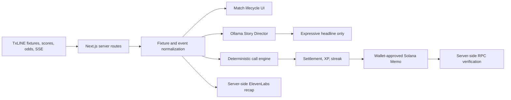

# PLOT TWIST — Technical Documentation

## Overview

PLOT TWIST is a white-label second-screen football experience. It converts
verified TxLINE match events into short, free fan calls, settles each call from
the same fixture feed, awards non-financial XP, and lets a fan preserve the
completed session as a wallet-signed Solana achievement.

- Production app: https://plot-twist-six.vercel.app
- Runtime readiness: https://plot-twist-six.vercel.app/api/demo-readiness
- Public repository: https://github.com/ILYUTKICK/plot-twist
- Submitted replay fixture: Spain–Belgium, TxLINE `fixtureId 18218149`

There is no wager, stake, payout, token reward, or promised financial value.

## Architecture



The system deliberately separates facts from presentation:

- **TxLINE** supplies fixture identity, match state, clock, score, events, and
  market data.
- **Deterministic TypeScript rules** build calls, enforce deadlines, decide the
  result, and calculate XP.
- **Ollama** may write only the two-part emotional headline. It cannot decide a
  winner or introduce match facts.
- **ElevenLabs** voices a server-built recap; it receives no API key from the
  browser.
- **Solana** stores a wallet-signed record of the fan session. It is an
  achievement, not a TxLINE-signed oracle proof.

## Match lifecycle

| TxLINE phase | Fan experience |
| --- | --- |
| Upcoming | Show verified kickoff, teams, available lineups/conditions, and published 1X2 data. Calls remain locked. |
| Live | Open a fixture-scoped call round from the verified clock and score. Goals, cards, shots on target, and corners can open new rounds. |
| Finished | Close calls and show final score, available event archive, statistics, accuracy, XP, streak, and achievement state. |

Fan sessions are persisted per fixture in the browser. Event IDs are deduplicated
so an SSE reconnect cannot award XP twice.

## TxLINE integration

Credentials never reach the browser. `lib/txline-client.ts` obtains a short-lived
guest JWT, adds the activation token as `X-Api-Token`, caches the JWT in the
server process, and retries once with a fresh JWT after `401` or `403`.

### Upstream endpoints used

| Method | TxLINE endpoint | Purpose |
| --- | --- | --- |
| `POST` | `/auth/guest/start` | Obtain the short-lived guest JWT. |
| `GET` | `/api/fixtures/snapshot` | Build the finished/live/upcoming tournament catalog. |
| `GET` | `/api/scores/snapshot/{fixtureId}` | Load selected-fixture score, clock, events, lineups, and conditions. |
| `GET` | `/api/scores/historical/{fixtureId}` | Load the verified Spain–Belgium judge replay. |
| `GET` | `/api/odds/updates/{epochDay}/{hour}/{interval}` | Reconstruct the submitted same-fixture historical 1X2 movement. |
| `GET` | `/api/scores/stream?fixtureId=…` | Receive fixture-scoped live match events and settle calls. |
| `GET` | `/api/odds/stream?fixtureId=…` | Receive fixture-scoped live market updates. |
| `GET` | `/api/odds/snapshot/{fixtureId}` | Load the selected fixture's current market snapshot. |

Server routes validate fixture IDs and proxy requests without exposing either
the activation token or guest JWT. Live clients also reject events whose
`fixtureId` does not match the selected match.

## Judge Mode and historical integrity

The main submission path uses TxLINE historical data for fixture `18218149`.
Playback time is compressed only for presentation. The fixture ID, source event
IDs, sequence, match minute, team, score, and event order are preserved.

The stable flow is:

1. Belgium's equalizer opens the initial story context.
2. The fan locks `Spain yellow card`.
3. The original TxLINE event at 42′ settles the first call.
4. The new verified event triggers the next Ollama headline and call set.
5. `Spain shot on target` is settled by the TxLINE event at 60′.
6. The completed two-call session can be stamped on Solana devnet.

Judge Mode is labelled `HISTORICAL REPLAY`; it is not presented as a live match.

## AI Story Director

`POST /api/story-director` validates the complete input before calling Ollama
Cloud. The model sees fixture teams, verified trigger, score, minute, deadline,
and market context, but its returned authority is limited to expressive copy.

The application replaces or constructs the factual recap, market sentence,
available choices, deadlines, scoring, and XP deterministically. Unsafe,
malformed, or unavailable model output falls back to a local template. Quiet
live periods use a verified-state template without fabricating an event.

## Voice recap

`POST /api/voice-recap` validates and limits recap text, applies a per-IP request
limit, and calls ElevenLabs `eleven_multilingual_v2` with a server-only key. It
returns `audio/mpeg` with private, no-store caching. If premium audio is
unavailable, the UI can fall back to the browser Web Speech API.

## Fan-call settlement

Every locked call contains a fixture ID, target event type, optional target team,
deadline minute, and XP value. Settlement requires:

- the same fixture;
- a matching event type;
- a matching team when the call is team-specific; and
- an event no later than the verified deadline.

An unrelated fixture or team cannot settle the call. Deadline expiry resets the
streak, and a call cannot settle twice.

## Solana achievement verification

The connected wallet approves a Solana devnet Memo containing a compact,
versioned fan-session record: fixture, event-ID prefixes, calls, XP, wallet,
network, and issue time.

`GET /api/solana/achievement/{signature}` calls `getTransaction` and checks that:

- the transaction succeeded;
- the requested signature is the transaction's first signature;
- the expected wallet signed the transaction and matches the Memo payload;
- the instruction belongs to the Memo Program;
- fixture, call uniqueness, event IDs, and XP pass schema validation.

A signature saved in `localStorage` is never trusted until this RPC verification
succeeds.

## Browser-facing API routes

| Route | Purpose |
| --- | --- |
| `GET /api/matches` | Normalized World Cup fixture catalog. |
| `GET /api/matches/{fixtureId}` | Full selected-match snapshot. |
| `GET /api/txline/stream?feed=scores&fixtureId=…` | Proxied score SSE. |
| `GET /api/txline/stream?feed=odds&fixtureId=…` | Proxied odds SSE. |
| `POST /api/story-director` | Validated Ollama headline generation. |
| `POST /api/voice-recap` | Server-side premium audio generation. |
| `GET /api/solana/achievement/{signature}` | Server-side on-chain achievement verification. |
| `GET /api/demo-readiness` | TxLINE, Ollama, and Solana health for the judge path. |

## Stack and deployment

- Next.js 15, React 19, and TypeScript
- TxLINE devnet API
- Ollama Cloud (`gpt-oss:20b`)
- ElevenLabs Text-to-Speech (`eleven_multilingual_v2`)
- Solana devnet with Wallet Standard and Memo Program
- Vercel Production

Required server-side configuration:

```text
TXLINE_API_ORIGIN
TXLINE_API_TOKEN
OLLAMA_BASE_URL
OLLAMA_API_KEY
OLLAMA_MODEL
ELEVENLABS_API_KEY
SOLANA_RPC_URL        # optional; defaults to public devnet RPC
```

No secret uses a `NEXT_PUBLIC_` prefix.

## Verification

```bash
npm test
npm run typecheck
npm run build
```

The current suite contains 28 tests covering fixture phases, TxLINE
normalization, replay integrity, fixture/team/deadline-aware resolution,
deduplication, Story Director boundaries, voice request security, achievement
schemas, and forged-XP or cross-fixture rejection.

## TxLINE API feedback

The strongest integration primitives were `FixtureId`, `Seq`, and `Ts` for
identity and ordering, historical score access for deterministic replay, and
`PriceNames` with `Pct` for participant mapping. The main friction points were
the split guest-JWT/activation-token lifecycle, historical score responses using
SSE framing, joining score participants to display names, and finding the
fixture-filter contract for global live streams.
